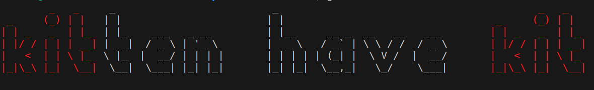

# ASCII Art Color

## Description
This is a simple command-line tool written in Go. It takes a string input entered by the user then returns its graphical representation using the ASCII art characters from the specified banner file. Additionally the program mainly focus on add colored art if color flag is passed.

## Usage
1. **Clone Repository**: Clone this repository to your local machine.
```bash 
git clone https://github.com/kh3rld/art-color
```
2. **Install go**: Ensure you have [Go](https://go.dev) installed on your machine.
3. **Run Program**: Execute the program by providing the flag, input string, and banner file as command-line arguments. 
    ```bash
    go run . --color=<color> <substring to be colored> "something"
    ```

    Example :

    ```bash
    go run . --color=red kit "kitten have kit"
    ```
    This will return the colored graphical representation of the string "kit".
    

Additionally, the program can run with a single string argument even when the user doesn't specify the flag.
```bash
    go run . hello 
```
```bash
     _              _   _          
    | |            | | | |         
    | |__     ___  | | | |   ___   
    |  _ \   / _ \ | | | |  / _ \  
    | | | | |  __/ | | | | | (_) | 
    |_| |_|  \___| |_| |_|  \___/  
                                
                                                          
```   
In this case, the result will be written to the default output file then automatically displayed on the terminal.

### Test
Use the below command to run tests for this program.
```go
go test
```


## Collaboration

This Project is Free and open-source, feel free to open issues and send pull requests; Happy coding :)

### Contributors

* **[Tomlee Abila](https://github.com/Tomlee-abila/)**
* **[Kherld Hussein](https://github.com/kherldhussein/)**